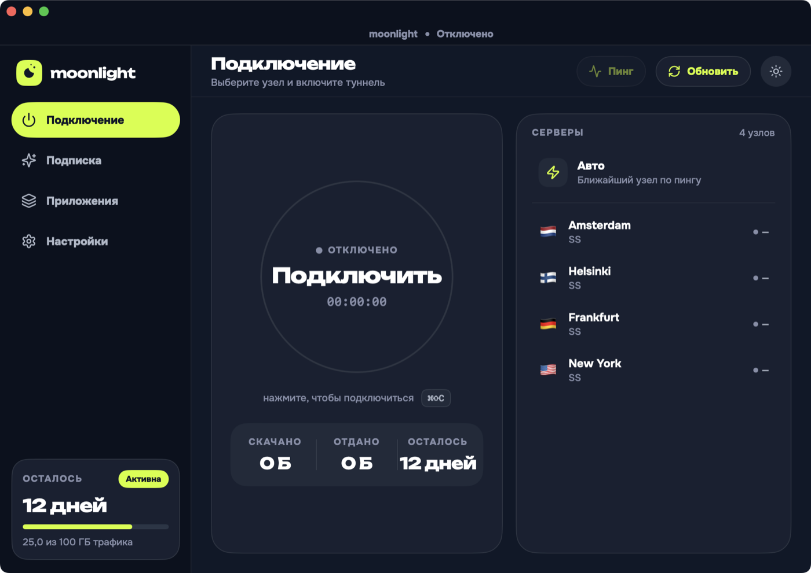
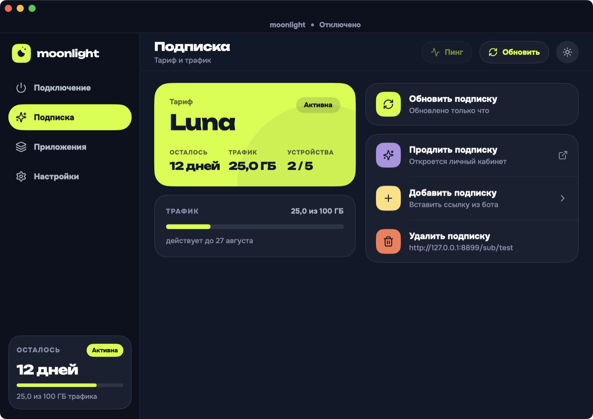
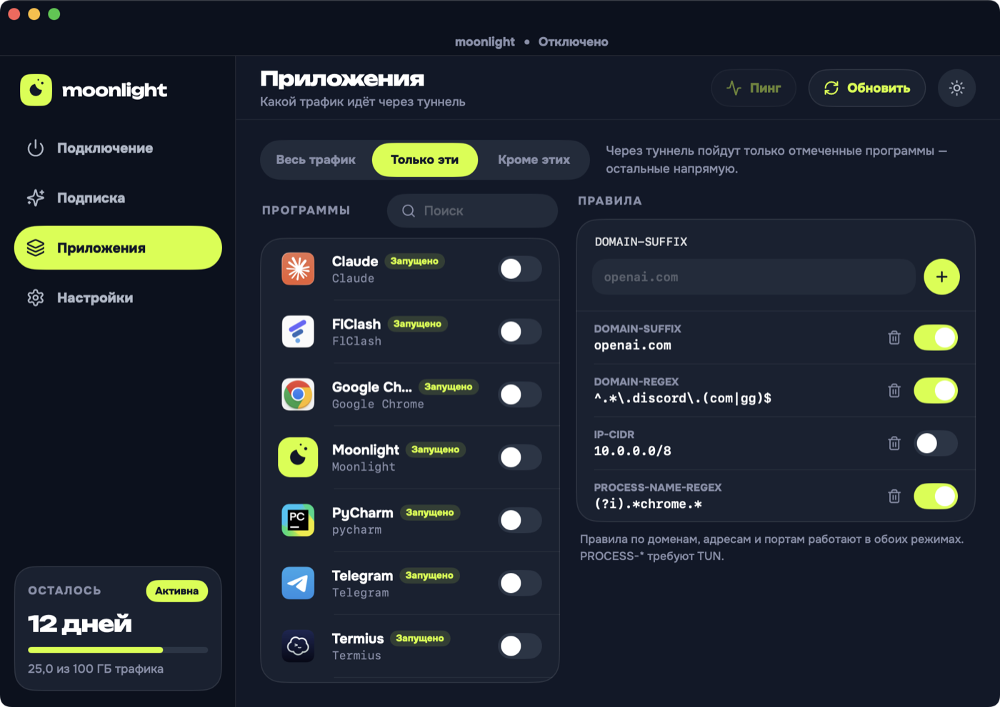
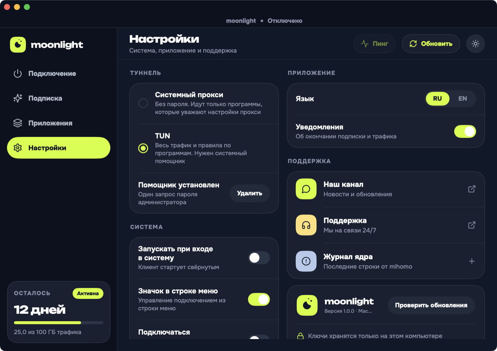
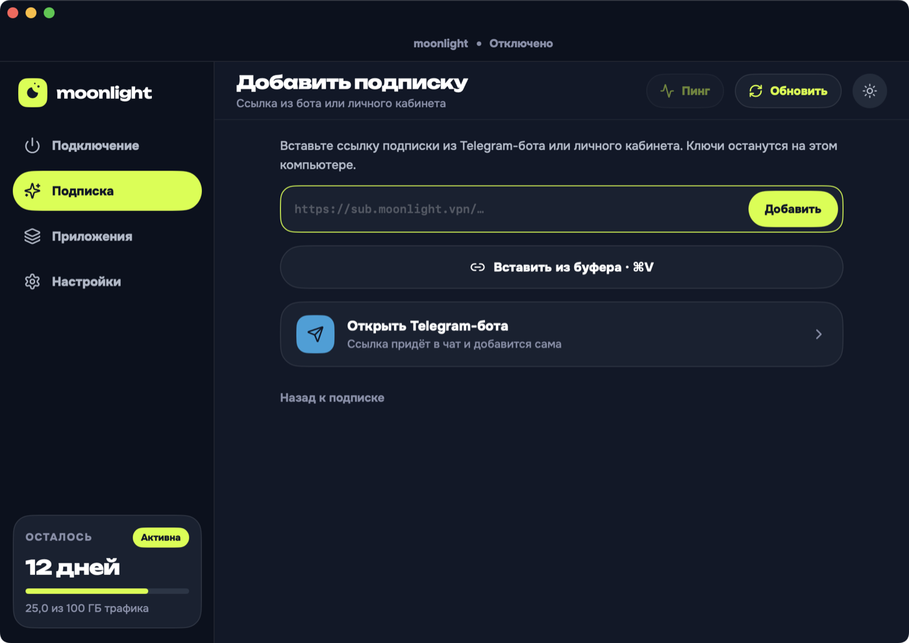

# Moonlight VPN — macOS

A SwiftUI client built on **[mihomo](https://github.com/MetaCubeX/mihomo) 1.19.29**,
implementing the `Moonlight Desktop` design. Subscriptions come from a Remnawave
panel. Companion to [moonlightvpn_android](https://github.com/kiineld/moonlightvpn_android),
which is the same product on Xray-core.



## Downloads

Latest release, always at the same URL:

```
https://github.com/kiineld/moonlightvpn_macos/releases/latest/download/Moonlight-universal.dmg
```

| Mac | File |
|---|---|
| Any — Intel and Apple silicon | `Moonlight-universal.dmg` |
| Apple silicon | `Moonlight-arm64.dmg` |
| Intel | `Moonlight-x86_64.dmg` |

The universal build runs everywhere; the per-architecture builds are about half
the size. The filenames carry no version, so those URLs keep working across
releases — the version is in the release title and in the bundle. macOS 13
Ventura or later.

Releases are cut by tagging: `git tag v1.2.3 && git push origin v1.2.3`.

### First launch

The app is **not notarised** — that needs a paid Apple Developer account — so
Gatekeeper refuses it the first time. Right-click the app in Applications and
choose *Open*, or:

```bash
xattr -dr com.apple.quarantine /Applications/Moonlight.app
```

## Architecture

```
MoonlightDesign   colour/type/motion tokens, lucide icons, an SVG path renderer
MoonlightCore     mihomo supervisor, RESTful API client, config builder,
                  subscription client, system proxy, helper client
Moonlight         SwiftUI screens, view models, the app itself
MoonlightHelper   the root LaunchDaemon that runs the core in TUN mode
```

`Moonlight → MoonlightCore, MoonlightDesign` · `MoonlightHelper` standalone.

There is **no Xcode project**. SwiftPM builds the executables and
`scripts/build-app.sh` assembles the bundle around them, so the whole thing —
including the test suite — builds with the Command Line Tools alone. Only a
universal (`ARCH=universal`) build needs full Xcode, because `swift build
--arch` shells out to `xcbuild`.

### The data path

```
app traffic → system proxy or utun → mihomo → VLESS/Trojan/SS node
                                        ↑
                        app ── RESTful API on 127.0.0.1:9797
```

The core is never reconfigured by restarting it. Switching a node, changing the
split mode, or loading a refreshed subscription all go through the API or a
config reload, so the tunnel survives every one of them.

## Two ways traffic reaches the tunnel

These are different mechanisms, not a preference.

| | System proxy | TUN |
|---|---|---|
| Privileges | none | root, via a helper installed once |
| Captures | apps that honour the system proxy | everything |
| Per-app rules | **no** | yes |

`SystemProxy` writes the same preferences the Network pane does, through
`networksetup`. What it buys is also what it costs: an app with its own socket
stack, or anything on QUIC, goes straight out the physical interface.

TUN takes a `utun` interface and captures everything, which needs root — and no
amount of entitlement work changes that for an unsigned app. The helper is a
LaunchDaemon installed with **one** administrator prompt, because asking for a
password on every connect is how people end up leaving TUN off.

### The helper's trust boundary

A root daemon taking instructions over a socket is a privilege escalation
waiting to happen, so it is deliberately narrow:

- **It never execs a path the client supplies.** The core binary is a root-owned
  copy made at install time; that path is compiled in. There is no field for
  naming another one.
- **It never opens a config path the client supplies.** The client sends config
  *text*; the helper writes it into its own root-owned directory. Otherwise a
  symlink into that directory would let any local user have root read a file.
- **The socket is 0660 root:admin**, so callers are exactly the accounts that can
  already run `sudo`. This spares the user a password prompt per connect; it is
  not a boundary against an administrator.

## Split tunnelling

Two ways in to one list of rules. The app toggles are a convenience over
`PROCESS-NAME`, matched on the **executable name** — `CFBundleExecutable`, not
the bundle id, because the core sees a process. The rules panel is the general
form:

| Kind | |
|---|---|
| `PROCESS-NAME` `PROCESS-NAME-REGEX` | by process, exact or regex |
| `PROCESS-PATH` `PROCESS-PATH-REGEX` | by executable path |
| `DOMAIN` `DOMAIN-SUFFIX` `DOMAIN-KEYWORD` `DOMAIN-REGEX` | by host |
| `IP-CIDR` `GEOIP` | by address |
| `GEOSITE` | by mihomo's site database |
| `DST-PORT` | by destination port |

The TUN constraint is **per rule, not per screen**. `PROCESS-*` rules need the
core to identify the process behind a connection, which only TUN can do — under
a system proxy the core is handed a socket with no process behind it, so those
rules are dropped from the generated config rather than written and silently
never matched. Domain, address and port rules work in both modes.

`find-process-mode` is only switched on when a process rule is actually present:
finding the process costs a syscall per connection, and a config of domain rules
does not need it.

A value is validated before it can be added — regexes are compiled, ports and
CIDRs are range-checked, and commas are refused because mihomo splits a rule on
them. This matters more than it looks: a bad rule does not fail on its own, the
core refuses the **whole config**, so the tunnel stops rather than the rule being
skipped.

The three modes are not symmetric, because preserving the panel's own routing
means something different in each:

| Mode | Rules |
|---|---|
| All traffic | the panel's rules, untouched |
| Except these | the split rules prepended pointing at `DIRECT` — what they match never reaches the panel's rules, everything else sees them as written |
| Only these | what they match is handed to the panel's rules through a `SUB-RULE`, and everything else falls to `MATCH,DIRECT` |

"Only these" could have pointed the rules straight at the selector, which is
simpler and wrong: it forces *all* of that traffic through the node, including
the hosts the panel deliberately routes direct, so a selected browser would lose
the panel's split for local sites.

An empty selection in "only these" falls back to tunnelling everything — an
empty allow-list routes nothing at all, which reads as a broken VPN rather than
as a configuration choice.

## Subscriptions

Remnawave serves a subscription in six shapes, chosen by a path suffix. The
order this client tries them is load-bearing:

1. **`<url>/mihomo`** — a Clash.Meta config written by the panel operator. It can
   carry proxy groups, a `url-test` balancer across a dozen nodes, its own DNS
   and routing rules.
2. **`<url>/clash`** — the same idea for stock Clash.
3. **The bare URL** — base64 or plain share links, one URI per node. Every group,
   balancer and routing rule is flattened away by that format, so a node whose
   panel entry was a balancer arrives as a single unusable placeholder.

The panel's document is then kept **verbatim**. `MihomoConfig` overrides only
what the client must own — the API address and secret, the local port,
`allow-lan: false` and a loopback bind, the TUN block, and the split rules. A
panel that ships a `geosite:category-ru → DIRECT` rule means it, and its tuning
is usually better than anything generated here.

Share links are still parsed for `vless://`, `vmess://`, `trojan://` and `ss://`
so the third path produces something usable. A Reality node with no `pbk` is
dropped there rather than passed on, because mihomo refuses the whole config
rather than skipping one node.

The subscription request carries Remnawave's device headers:

```
x-hwid:         <random UUID, minted once, stored in UserDefaults>
x-device-os:    macOS
x-ver-os:       <system version>
x-device-model: <MacBook Pro, …>
```

The HWID is a **random UUID, not a hardware identifier**. It gives the panel a
stable per-install handle for its device limit and carries no hardware identity
off the machine.

`subscription-userinfo` and `profile-title` response headers take precedence
over `<url>/info`, field by field, because they are what every panel implements
consistently. A missing field reads as *unknown* rather than zero — a plan whose
panel omits `total` is unlimited, and showing "0 GB" for it would be a lie the
user acts on.

### The subscription client ignores the system proxy

This is the macOS counterpart of the Android client excluding itself from its
own tunnel. While connected in system-proxy mode the app has pointed the whole
machine at its own core, and a shared `URLSession` would send the panel request
back through the tunnel it is managing. It also means a stale proxy left behind
by any other client cannot swallow this app's requests — which is a silent hang
with no timeout, because the connection is established and simply never
answered.

## Latency probing

Measured through the running core's `/proxies/{name}/delay`, so each probe uses
that node's own outbound. The core multiplexes them, so a full pass costs about
as long as its slowest node rather than the sum; concurrency is still capped at
8, because a subscription with sixty nodes would otherwise open sixty TLS
handshakes at once and measure congestion instead of latency.

Only possible while connected — the outbounds do not exist until the core is up.
An unreachable node reports *unknown*, not an error: a timeout is the expected
answer for a node that is down.

## Geodata

Not shipped. mihomo downloads `GeoSite.dat`/`GeoIP.dat` on demand into
`~/Library/Application Support/Moonlight/core/` the first time a config
references a `geosite:`/`geoip:` rule, which every panel config does. That costs
one download on first connect and saves ~24 MB in the bundle.

## Design system

Tokens map one-for-one from the source CSS. Dark is lime `#D2FF1F` on slate
`#101828`; light flips the accent to yellow `#FFE078`. The accent splits into
four roles that must stay distinct, because light mode depends on it:

- `accent` — fills (buttons, the dial sweep, active pills)
- `accentInk` — accent as type or a glyph (`#EFAE2E` in light)
- `accentInkStrong` — accent type sitting *on* an accent wash
- `accentLine` — accent as a thin mark (bars, dots, rings)

Icons are **lucide 0.468.0**, the set the design is drawn with, carried across as
raw SVG path data rather than redrawn or swapped for SF Symbols, so stroke
geometry is identical. `scripts/gen-icons.py` converts every `<circle>`,
`<rect>`, `<line>` and `<polyline>` to path commands at generation time, so the
renderer only parses `d` strings.

Fonts are Onest (UI/body) and Unbounded (display) as variable TTFs from Google
Fonts — the design ships `woff2`, which Core Text cannot register.

The connect dial's ring shows **how much traffic quota is left**, so a healthy
subscription reads as a nearly full ring and drains with use. With no quota to
report, a connected tunnel shows a full ring.

| | |
|---|---|
|  |  |
|  |  |

## Building

```bash
scripts/fetch-mihomo.sh   # ~90 MB, lipo'd from the two darwin releases
scripts/fetch-fonts.sh
scripts/build-app.sh      # build/Moonlight.app
```

`ARCH=universal scripts/build-app.sh` for both slices, which needs full Xcode.
`scripts/make-dmg.sh` packages it. `scripts/screenshots.sh` regenerates the
images above.

Requires Swift 5.9+ (Xcode 15 Command Line Tools) and macOS 13+.

## Tests

```bash
swift run moonlight-tests
```

180 checks. A plain executable rather than XCTest, because XCTest ships with
Xcode and this package builds with the Command Line Tools alone.

They cover the parts where correctness is not visual: `subscription-userinfo`
parsing (partial, malformed, absent, zero-means-unlimited), share-link metadata
across four schemes, URL normalisation (a `file://` or `vless://` link must not
be rewritten into a plausible `https://` one), config assembly, and all three
split modes, and every rule kind the UI offers — each one checked in **both**
positions, as a plain rule and inside a `SUB-RULE` matcher, because mihomo
accepts different grammars in the two and a rule that only works in one produces
a config the core refuses.

The last suite runs the **real mihomo binary**: every config shape the app can
produce goes through `mihomo -t`, and one is started for real so the RESTful API
— the app's entire control channel — is exercised rather than assumed. TUN
configs are validated but never started, because a test suite must not ask for
root.

## Configuration

`Info.plist` keys, written by `scripts/build-app.sh` from the environment, so a
fork points these at its own endpoints without touching source:

| Key | Environment variable | Purpose |
|---|---|---|
| `MLTelegramBotURL` | `TELEGRAM_BOT_URL` | "Open the Telegram bot", "Extend subscription" |
| `MLTelegramChannelURL` | `TELEGRAM_CHANNEL_URL` | Settings → Our channel |
| `MLSupportURL` | `SUPPORT_URL` | Settings → Support |
| `MLReleasesURL` | `RELEASES_URL` | "Check for updates" |

In CI these come from repository **variables** of the same name. They default to
`https://t.me/`; point them at real endpoints before shipping.

`NSAllowsArbitraryLoads` is set. A subscription URL points at whatever host the
panel operator runs, and self-hosted panels are routinely reached by bare IP with
a self-signed certificate. The client upgrades a bare host to `https://`, so
cleartext only happens when the user types `http://` themselves.

### When TUN cannot start

`auto-route` installs routes covering the internet, and another VPN client
holding them makes the core log

```
Start TUN listening error: configure tun interface: add route: 1.0.0.0/8: file exists
```

and then **keep running**. It answers its API normally with no interface
established, so every other signal says "connected" while nothing is routed.
`connect()` therefore checks the log for that line before reporting success, and
names the cause rather than quoting the core at the user. The TUN block also
leaves the device name to the core, because a hardcoded `utun7` collides with
whichever client already holds it.

## Known limitations

- **A tunnel carrying traffic has not been confirmed.** Against a live
  Remnawave panel the subscription is fetched, the config is built and the core
  loads it with the panel's own geosite rules intact — that much is observed
  from a real run. TUN then failed on that machine because another VPN client
  already held the routes, which is what the check below now reports. The
  remaining step, packets flowing to a node, is unverified.
- **Sidebar hover in light mode is unverified.** It was a white wash on a
  near-white sidebar; it is now an accent tint with accent-ink text and a
  hairline. Synthetic pointer events do not reach SwiftUI's tracking areas, so
  the change is by construction rather than observed.
- **Not notarised.** See *First launch*.
- The entrance stagger is attached with `.animation(_:value:)` rather than
  `withAnimation`, so if the animation is dropped the card appears without
  sliding. The alternative left cards stuck at zero opacity.
- Pasting a bare `vless://` link imports nothing; the import path expects a
  subscription URL. Single-node import is not implemented.
- Reconnect-on-network-change is not implemented.
- `moonlight://` is registered as a URL scheme in `Info.plist`, but the handler
  is not wired up yet.

## Licence

MIT — see [LICENSE.md](LICENSE.md), which also lists the third-party components.
