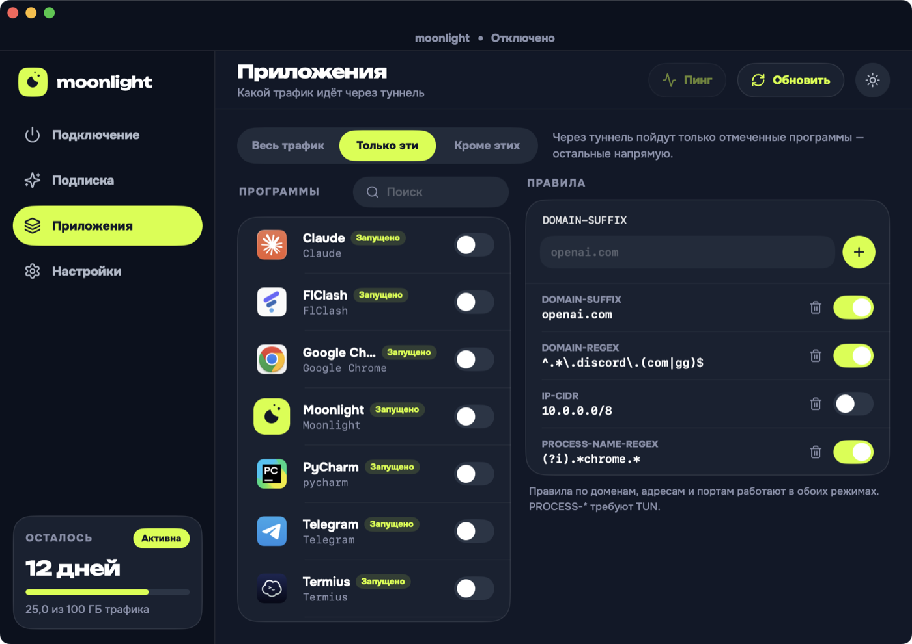

# Moonlight VPN — macOS

A SwiftUI client built on **[mihomo](https://github.com/MetaCubeX/mihomo) 1.19.29**,
implementing the `Moonlight Desktop` design. Subscriptions come from a Remnawave
panel. Companion to [moonlightvpn_android](https://github.com/kiineld/moonlightvpn_android),
which is the same product on Xray-core.


## Downloads

Latest release, always at the same URL:

```
https://github.com/kiineld/moonlightvpn_macos/releases/latest/download/Moonlight-universal.dmg
```

| Mac | File |
|---|---|
| Any — Intel and Apple silicon | `Moonlight-universal.dmg` |
| Apple silicon | `Moonlight-arm64.dmg` |
| Intel | `Moonlight-x86_64.dmg` |

The universal build runs everywhere; the per-architecture builds are about half
the size. The filenames carry no version, so those URLs keep working across
releases — the version is in the release title and in the bundle. **macOS 12
Monterey or later.**

Releases are cut by tagging: `git tag v1.2.3 && git push origin v1.2.3`.

### First launch

The app is **not notarised** — that needs a paid Apple Developer account — so
Gatekeeper refuses it the first time. Right-click the app in Applications and
choose *Open*, or:

```bash
xattr -dr com.apple.quarantine /Applications/Moonlight.app
```

## Architecture

```
MoonlightDesign   colour/type/motion tokens, lucide icons, an SVG path renderer
MoonlightCore     mihomo supervisor, RESTful API client, config builder,
                  subscription client, system proxy, helper client
Moonlight         SwiftUI screens, view models, the app itself
MoonlightHelper   the root LaunchDaemon that runs the core in TUN mode
```

`Moonlight → MoonlightCore, MoonlightDesign` · `MoonlightHelper` standalone.

There is **no Xcode project**. SwiftPM builds the executables and
`scripts/build-app.sh` assembles the bundle around them, so the whole thing —
including the test suite — builds with the Command Line Tools alone. Only a
universal (`ARCH=universal`) build needs full Xcode, because `swift build
--arch` shells out to `xcbuild`. Tools that ship the macOS 27 SDK cannot find
the SwiftUI macro plugin under it; build against the 26.5 SDK there with
`SDKROOT=/Library/Developer/CommandLineTools/SDKs/MacOSX26.5.sdk`.

### The data path

```
app traffic → system proxy or utun → mihomo → VLESS/Trojan/SS node
                                        ↑
                        app ── RESTful API on 127.0.0.1:9797
```

The core is never reconfigured by restarting it. Switching a node, changing the
split mode, or loading a refreshed subscription all go through the API or a
config reload, so the tunnel survives every one of them. The config is kept
inside the core's home, `…/Moonlight/core/config.yaml`: mihomo reloads only from
a path under its home directory, and a config kept beside it started fine and
then failed every refresh.

### The core runs whether or not the tunnel is on

A core being up and traffic being routed through it are separate facts, and this
client keeps them separate. As soon as there is a subscription the core starts —
with no proxy settings written and no TUN block in its config, so it routes
nothing. Connecting then only points traffic at a core that is already warm.

That is what makes a latency pass immediate: the outbounds a probe needs already
exist, so pressing ping starts measuring instead of starting a core. It is
also how FlClash and Clash Verge Rev behave, and why their ping feels instant.

TUN is the one exception. Its core has to run as root under the helper, so
connecting there stops the idle core and starts the privileged one; disconnecting
reverses it.

## Two ways traffic reaches the tunnel

These are different mechanisms, not a preference.

| | System proxy | TUN |
|---|---|---|
| Privileges | none | root, via a helper installed once |
| Captures | apps that honour the system proxy | everything |
| Per-app rules | **no** | yes |

`SystemProxy` writes the same preferences the Network pane does, through
`networksetup`. What it buys is also what it costs: an app with its own socket
stack, or anything on QUIC, goes straight out the physical interface.

TUN takes a `utun` interface and captures everything, which needs root — and no
amount of entitlement work changes that for an unsigned app. The helper is a
LaunchDaemon installed with **one** administrator prompt, because asking for a
password on every connect is how people end up leaving TUN off.

### The helper's trust boundary

A root daemon taking instructions over a socket is a privilege escalation
waiting to happen, so it is deliberately narrow:

- **It never execs a path the client supplies.** The core binary is a root-owned
  copy made at install time; that path is compiled in. There is no field for
  naming another one.
- **It never opens a config path the client supplies.** The client sends config
  *text*; the helper writes it into its own root-owned directory. Otherwise a
  symlink into that directory would let any local user have root read a file.
- **The socket is 0660 root:admin**, so callers are exactly the accounts that can
  already run `sudo`. This spares the user a password prompt per connect; it is
  not a boundary against an administrator.

## Logs and connections

Two screens over the core's own streams.

**Logs** merges the core's `/logs` with the app's own narration on one timeline,
and that pairing is the point: read apart, a failed connect is a core error with
no cause; together it is "the app switched to TUN, then the core could not take
the route". Filterable by source, by level (as a floor — WARN means warnings and
errors) and by text.

**Connections** polls `/connections` once a second and groups by process, which
is the question people actually bring to it: is *this program* going through the
tunnel. Expanding a row shows the hosts behind it, each with the node that
carried it and the rule that chose. Any row can be closed — one process's
connections or a single one — because the core reopens whatever the program
still wants, so closing reads as "move this app onto the node I just picked"
rather than as cutting it off. `find-process-mode` is therefore always on —
it costs a `libproc` lookup per connection, and without it every row reads "—".

### Page changes do not cross-fade

Deliberately. Every transition tried — a crossfade, or `.identity` on the
removal — keeps the outgoing screen in the hierarchy for the length of the
animation, so the previous page shows *through* the new one and reads as a
blink. The page swaps at once and the incoming screen plays its own entrance,
which starts only after the old one is gone.

### One core, one controller port

A privileged core outlives the app that started it: it is a root daemon's child,
not the app's. Left running from a previous session it holds the controller
port, so the core this session starts cannot bind it and **every API call
silently addresses the old core instead** — wrong nodes, wrong connections, and
a tunnel still carrying traffic while the window says "Отключено". Launch
therefore stops any privileged core it did not ask for, alongside restoring the
proxy settings.

That clean-up is also why **only one copy runs at a time**. A second copy — say
one opened from the DMG while the installed one runs — would take the first
one's core for an orphan and stop it. It now brings the running copy forward
and exits before touching anything.

### Quitting, and starting at login

Quitting brings everything down — routing, the proxy settings, and the idle core
too, which `disconnect()` deliberately keeps warm while the app is open. The
teardown runs under `.terminateLater`; it used to be awaited on a semaphore in
`applicationWillTerminate`, which blocked the very thread the disconnect needed,
so every quit stalled eight seconds and then left the tunnel up. Quitting is
also quick now: the idle core is signalled and not waited for (it owns no system
state), and only the proxy settings this app changed are put back. Restoring
with no snapshot used to switch **every** proxy off on every network service —
TUN never sets one, so each TUN disconnect turned off any other client's proxy,
at three `networksetup` runs per service.

The app starts at login when **Запускать при входе в систему** is on, and only
then. The switch is read from the system (`SMAppService`, or the LaunchAgent on
Monterey) rather than from a stored preference, and after a change it settles on
what actually registered. The app also opts out of macOS relaunching it at
login — a menu bar app is still running at shutdown, so "reopen windows" brought
it back regardless of the switch. A login launch starts tucked away: into the
menu bar when the icon is there, otherwise minimised to the Dock.

## Updating

The app is not notarised and there is no App Store, so **Settings → Проверить
обновления** does what a user would otherwise do by hand: ask GitHub for the
latest release, download the universal DMG, and swap the bundle.

The swap runs in a **detached shell script**, not in-process. An app cannot
replace its own bundle while running, and a process that deletes its own
executable behaves unpredictably from that moment on. The script waits for the
app to exit, mounts the image, `ditto`s the new bundle over the old one —
restoring the old one if the copy fails, rather than leaving no app at all — and
relaunches.

Versions compare numerically, so 1.0.10 beats 1.0.9; a string comparison gets
that backwards.

## Split tunnelling

Two ways in to one list of rules. The app toggles are a convenience over
`PROCESS-NAME`, matched on the **executable name** — `CFBundleExecutable`, not
the bundle id, because the core sees a process. The rules panel is the general
form:

| Kind | |
|---|---|
| `PROCESS-NAME` `PROCESS-NAME-REGEX` | by process, exact or regex |
| `PROCESS-PATH` `PROCESS-PATH-REGEX` | by executable path |
| `DOMAIN` `DOMAIN-SUFFIX` `DOMAIN-KEYWORD` `DOMAIN-REGEX` | by host |
| `IP-CIDR` `GEOIP` | by address |
| `GEOSITE` | by mihomo's site database |
| `DST-PORT` | by destination port |

The TUN constraint is **per rule, not per screen**. `PROCESS-*` rules need the
core to identify the process behind a connection, which only TUN can do — under
a system proxy the core is handed a socket with no process behind it, so those
rules are dropped from the generated config rather than written and silently
never matched. Domain, address and port rules work in both modes.

`find-process-mode` is only switched on when a process rule is actually present:
finding the process costs a syscall per connection, and a config of domain rules
does not need it.

A value is validated before it can be added — regexes are compiled, ports and
CIDRs are range-checked, and commas are refused because mihomo splits a rule on
them. This matters more than it looks: a bad rule does not fail on its own, the
core refuses the **whole config**, so the tunnel stops rather than the rule being
skipped.

The three modes are not symmetric, because preserving the panel's own routing
means something different in each:

| Mode | Rules |
|---|---|
| All traffic | the panel's rules, untouched |
| Except these | the split rules prepended pointing at `DIRECT` — what they match never reaches the panel's rules, everything else sees them as written |
| Only these | what they match is handed to the panel's rules through a `SUB-RULE`, and everything else falls to `MATCH,DIRECT` |

"Only these" could have pointed the rules straight at the selector, which is
simpler and wrong: it forces *all* of that traffic through the node, including
the hosts the panel deliberately routes direct, so a selected browser would lose
the panel's split for local sites.

An empty selection in "only these" falls back to tunnelling everything — an
empty allow-list routes nothing at all, which reads as a broken VPN rather than
as a configuration choice.

## Subscriptions

Remnawave serves a subscription in six shapes, chosen by a path suffix. The
order this client tries them is load-bearing:

1. **`<url>/mihomo`** — a Clash.Meta config written by the panel operator. It can
   carry proxy groups, a `url-test` balancer across a dozen nodes, its own DNS
   and routing rules.
2. **`<url>/clash`** — the same idea for stock Clash.
3. **The bare URL** — base64 or plain share links, one URI per node. Every group,
   balancer and routing rule is flattened away by that format, so a node whose
   panel entry was a balancer arrives as a single unusable placeholder.

The panel's document is then kept **verbatim**. `MihomoConfig` overrides only
what the client must own — the API address and secret, the local port,
`allow-lan: false` and a loopback bind, the TUN block, and the split rules. A
panel that ships a `geosite:category-ru → DIRECT` rule means it, and its tuning
is usually better than anything generated here.

Share links are still parsed for `vless://`, `vmess://`, `trojan://` and `ss://`
so the third path produces something usable. A Reality node with no `pbk` is
dropped there rather than passed on, because mihomo refuses the whole config
rather than skipping one node.

The subscription request carries Remnawave's device headers:

```
x-hwid:         <random UUID, minted once, stored in UserDefaults>
x-device-os:    macOS
x-ver-os:       <system version>
x-device-model: <MacBook Pro, …>
```

The HWID is a **random UUID, not a hardware identifier**. It gives the panel a
stable per-install handle for its device limit and carries no hardware identity
off the machine.

### Response headers

Every header Remnawave sends (`ISubscriptionHeaders` in its backend) is read,
and each takes precedence over `<url>/info`, field by field. A missing field
reads as *unknown* rather than zero — a plan whose response omits `total` is
unlimited, and showing "0 GB" for it would be a lie the user acts on.

| Header | Used for |
|---|---|
| `subscription-userinfo` | traffic used and allowed, expiry; `0` means unlimited |
| `profile-title` | the plan name |
| `announce` | a banner on the connect and subscription screens, hidden per message |
| `profile-web-page-url` | where **Продлить подписку** goes, before the bot |
| `support-url` | where **Поддержка** goes, before the built-in link |
| `profile-update-interval` | the default auto-update interval, in hours |
| `subscription-refill-date` | "Трафик обновится …" under the traffic bar |
| `x-hwid-max-devices-reached`, `x-hwid-not-supported` | the device-limit answer |
| `content-disposition`, `routing` | not read — an account name, and another client's routing profile |

Text values may come as `base64:<payload>` — how Remnawave renders anything its
operator wrapped in `rwEncodeBase64:` — and are decoded, URL-safe alphabet and
missing padding included. Links are accepted only as `https`/`http` (and `tg`,
`mailto` for support), since the app opens them on a click.

At its device limit Remnawave answers **HTTP 200 with an empty body** and says
so only in a header. Read without it, that was "the subscription is empty"; it
is now the device limit, with the service's own `announce` text when it sent
one, and the other endpoints are not tried after it. Remnawave also spells
"never expires" as a date in 2099 in `/info` (its headers send `0`); that is
read as no expiry, not as 26 892 days.

### Auto-update

**Настройки → Автообновление подписки**: off, or every 1, 6, 12 or 24 hours.
Until one is picked the service's `profile-update-interval` applies, snapped to
the nearest of those, and a day when it sends none. The schedule survives
relaunches — the time of the last successful refresh is stored — and is checked
every five minutes and on wake, so a Mac asleep through the due time refreshes
when it opens. Launch refreshes only when due; "off" means only the refresh
button and ⌘R.

A new link replaces the current one **only once it has loaded**. It used to be
stored first, so a mistyped link — or the server having a bad minute — left a
working subscription replaced by one that loaded nothing.

### Nothing about the service reaches the screen

No screen names the service behind the subscription, or shows the link, a
server's address or a credential:

- Errors are a `TunnelIssue` the app words itself, in Russian or English —
  "Сервер подписки временно недоступен (ошибка 502)", not "Panel returned HTTP
  502". The technical description goes to the log.
- The log masks, in every line and in lines already kept, the subscription link,
  its host and token, and every server the subscription names — core errors
  quote server addresses (`dial tcp …`).
- The subscription screen no longer prints the link under "Удалить подписку";
  the link is a credential.
- The account username from `/info` is not used as the plan name.

### The subscription client ignores the system proxy

This is the macOS counterpart of the Android client excluding itself from its
own tunnel. While connected in system-proxy mode the app has pointed the whole
machine at its own core, and a shared `URLSession` would send the subscription request
back through the tunnel it is managing. It also means a stale proxy left behind
by any other client cannot swallow this app's requests — which is a silent hang
with no timeout, because the connection is established and simply never
answered.

## Latency probing

Measured through the running core's `/proxies/{name}/delay` against
`http://cp.cloudflare.com/generate_204`, so each probe uses that node's own
outbound. The same target drives the `url-test` group this client injects.

**http, not https**, and Cloudflare rather than Google: the probe is timing the
path to the node, and a TLS handshake to the *target* adds a round trip that
says nothing about it. Cloudflare answers `204` with an empty body from a global
anycast address, so the number is about the node rather than about which
continent the target sits on. Switching to it on a live 20-node subscription
took the fastest node from 162 ms to 37 ms and raised the nodes that answered at
all from 10 to 18 — `gstatic.com` is itself blocked or slow from several of
them, which made the probe measure the target's reachability instead of the
node's. The core multiplexes them, so a full pass costs about
as long as its slowest node rather than the sum; concurrency is still capped at
8, because a subscription with sixty nodes would otherwise open sixty TLS
handshakes at once and measure congestion instead of latency.

Available whether or not the tunnel is up, because a core is always running.

Results are applied **as each node answers** rather than at the end of the pass.
A pass over twenty nodes takes several seconds no matter how it is written — the
dead ones have to time out — so reporting each result as it lands is what makes
it feel immediate: the fast nodes, which are the ones being chosen between,
appear straight away instead of behind the slowest entry in the list.

Numbers are kept in preferences, so they survive a screen change, a reconnect
and a relaunch. A measurement opens a connection through every node, and
throwing it away because the user looked at Settings makes the server list
useless exactly when they are choosing from it.

An unreachable node reads **n/a**, not an error and not a dash: a timeout is the
expected answer for a node that is down, and "not measured yet" is a different
thing worth telling apart from it.

## Geodata

Not shipped. mihomo downloads `GeoSite.dat`/`GeoIP.dat` on demand into
`~/Library/Application Support/Moonlight/core/` the first time a config
references a `geosite:`/`geoip:` rule, which every panel config does. That costs
one download on first connect and saves ~24 MB in the bundle.

## Design system

Tokens map one-for-one from the source CSS. Dark is lime `#D2FF1F` on slate
`#101828`; light flips the accent to yellow `#FFE078`. The accent splits into
four roles that must stay distinct, because light mode depends on it:

- `accent` — fills (buttons, the connect knob, active pills)
- `accentInk` — accent as type or a glyph (`#EFAE2E` in light)
- `accentInkStrong` — accent type sitting *on* an accent wash
- `accentLine` — accent as a thin mark (bars, dots, rings)

Icons are **lucide 0.468.0**, the set the design is drawn with, carried across as
raw SVG path data rather than redrawn or swapped for SF Symbols, so stroke
geometry is identical. `scripts/gen-icons.py` converts every `<circle>`,
`<rect>`, `<line>` and `<polyline>` to path commands at generation time, so the
renderer only parses `d` strings.

Fonts are Onest (UI/body) and Unbounded (display) as variable TTFs from Google
Fonts — the design ships `woff2`, which Core Text cannot register.

The connect screen is deliberately bare: how long the tunnel has been up, one
button, and its state in words. The button is a squircle holding a round knob —
neutral with a power glyph when off, filled with the accent and carrying a stop
square when on — so the change of state is a change of colour, not of layout.
The state pill under it leads to the connections screen. Ping and refresh are
icon buttons over the server list, the list they act on; the theme switch lives
in Settings. What is left of the plan sits in the sidebar, the one place it is
shown.

The server list works as on the phone: a pill naming the server in use, which
opens into the full list beneath it. The list is always in the hierarchy and
only its height moves — from nothing to its measured content, capped to the
window and scrolling past that — on a spring, so opening is one continuous
motion. Picking a server closes it. Closed, the button and the pill sit in the
middle of the page; opening the list lifts them to the top on the same spring,
and the list takes the room that frees. A latency reads `–` until the server has
been probed, and `n/a` only once a probe got no answer within 5000 ms; timeouts
are remembered across launches like the numbers are.

The window is a `bgDeep` canvas with two soft washes bleeding in from opposite
corners, and a floating sidebar inset 8pt from its edges, starting just under
the traffic lights. Cards carry no outline — the canvas is a step darker than
any surface on it in both themes, so the surface alone separates them. The
sidebar collapses to a 64pt icon rail from the half-circle tab halfway down its
edge; the tab's chevron points the way a click moves it — left to collapse,
right to open. Collapsing is animated where it is triggered, so the page
beside the sidebar moves with it instead of jumping to its new width.

### Liquid Glass

On macOS 26 and later every surface is Liquid Glass: the sidebar and its active
row, cards, buttons, pills, fields and the segmented controls' tracks. Accent
fills become accent-tinted glass — the plan card is lime glass — while icon
tiles, the logo and small status chips stay solid, because their colour is the
information. Before 26 the same shapes are drawn as flat surfaces, at the same
sizes, so nothing moves between systems. The canvas washes are there for the
glass: over a flat colour it has nothing to bend and reads as a grey card.

The sidebar's tab is not a separate piece of glass. The panel and a circle
centred on its edge sit in one `NSGlassEffectContainerView`, which draws
touching glass as a single piece — so the tab is a bump grown out of the panel
with one continuous rim, where a glass view clipped to a half shape showed its
square rim as a notch.

The glass is `NSGlassEffectView`, looked up **by name at runtime**
(`Sources/Moonlight/Glass.swift`). Neither the Command Line Tools this builds
with nor CI's Xcode ships the macOS 26 SDK, so neither that class nor SwiftUI's
`glassEffect` exists at compile time — but the class is there at runtime
whatever SDK the app was linked against, and `style`, `tintColor` and
`cornerRadius` are plain Objective-C properties that key-value coding reaches
without headers. Each key is checked with `responds(to:)` first, because KVC
raises on a key it does not know: a property renamed in some later release costs
the effect, not the app. The glass view also sits inside a host that returns
`nil` from `hitTest`, since an `NSView` in a SwiftUI button's label otherwise
swallows the click.

| | |
|---|---|
|  |  |
|  |  |

## Building

```bash
scripts/fetch-mihomo.sh   # ~90 MB, lipo'd from the two darwin releases
scripts/fetch-fonts.sh
scripts/build-app.sh      # build/Moonlight.app
```

`ARCH=universal scripts/build-app.sh` for both slices, which needs full Xcode.
`scripts/make-dmg.sh` packages it, styling the installer window — background,
icon positions, no toolbar — through Finder, because that styling lives in the
volume's `.DS_Store` and Finder is what writes it. Without a GUI session the
image is still produced, plain but with the Applications symlink, so it installs
by dragging either way. The backdrop is drawn by
`scripts/make-dmg-background.swift` rather than shipped as an asset, so it stays
in step with the palette. `scripts/screenshots.sh` regenerates the
images above.

Requires Swift 5.9+ (Xcode 15 Command Line Tools) and macOS 12+.

### Staying on Monterey

The deployment target is 12.0, which rules out three APIs the app would
otherwise use:

| macOS 13 API | What is used instead |
|---|---|
| `MenuBarExtra` | an AppKit `NSStatusItem`, one path for every version |
| `SMAppService` | a LaunchAgent the app writes into `~/Library/LaunchAgents` |
| `scrollIndicators` | nothing — the scroller keeps its default behaviour |
| `onContinuousHover` | the pointer is pushed on hover and popped on exit |
| `ViewThatFits` | a scroll view always — the server list fills its card |

The status item is arguably the better arrangement anyway: its menu is rebuilt
each time it opens, so the traffic figures and node list are correct at the
moment they are read rather than whenever SwiftUI last re-rendered them.

`otool -l` on a release binary reports `minos 12.0`, not just the plist.

## Tests

```bash
swift run moonlight-tests
```

227 checks. A plain executable rather than XCTest, because XCTest ships with
Xcode and this package builds with the Command Line Tools alone.

They cover the parts where correctness is not visual: `subscription-userinfo`
parsing (partial, malformed, absent, zero-means-unlimited), share-link metadata
across four schemes, URL normalisation (a `file://` or `vless://` link must not
be rewritten into a plausible `https://` one), config assembly, and all three
split modes, and every rule kind the UI offers — each one checked in **both**
positions, as a plain rule and inside a `SUB-RULE` matcher, because mihomo
accepts different grammars in the two and a rule that only works in one produces
a config the core refuses.

The last suite runs the **real mihomo binary**: every config shape the app can
produce goes through `mihomo -t`, and one is started for real so the RESTful API
— the app's entire control channel — is exercised rather than assumed. TUN
configs are validated but never started, because a test suite must not ask for
root.

## Configuration

`Info.plist` keys, written by `scripts/build-app.sh` from the environment, so a
fork points these at its own endpoints without touching source:

| Key | Environment variable | Purpose |
|---|---|---|
| `MLTelegramBotURL` | `TELEGRAM_BOT_URL` | "Open the Telegram bot", "Extend subscription" |
| `MLTelegramChannelURL` | `TELEGRAM_CHANNEL_URL` | Settings → Our channel |
| `MLSupportURL` | `SUPPORT_URL` | Settings → Support |
| `MLReleasesURL` | `RELEASES_URL` | "Check for updates" |

In CI these come from repository **variables** of the same name, which are set on
this repository. The source defaults match them, so a local build reaches the
same places.

`NSAllowsArbitraryLoads` is set. A subscription URL points at whatever host the
panel operator runs, and self-hosted panels are routinely reached by bare IP with
a self-signed certificate. The client upgrades a bare host to `https://`, so
cleartext only happens when the user types `http://` themselves.

### When TUN cannot start

`auto-route` installs routes covering the internet, and another VPN client
holding them makes the core log

```
Start TUN listening error: configure tun interface: add route: 1.0.0.0/8: file exists
```

and then **keep running**. It answers its API normally with no interface
established, so every other signal says "connected" while nothing is routed.
`connect()` therefore checks the log for that line before reporting success, and
names the cause rather than quoting the core at the user. The log checked is the
helper's: the tunnel counts as TUN from the moment the helper takes the config,
so the check reads the core that was just started, and a failure stops it. The TUN block also
leaves the device name to the core, because a hardcoded `utun7` collides with
whichever client already holds it.

## Known limitations

- **The tunnel has not been left up carrying ordinary traffic.** Against a live
  Remnawave panel the subscription is fetched, the config is built, the core
  loads it with the panel's own geosite rules intact, and nodes answer a
  `generate_204` through a full VLESS handshake — 10 of 20 on the pass observed,
  the rest timing out as down. So traffic does reach the nodes. What has not
  been exercised is a session left connected with the machine's own traffic
  going through it.
- **Not notarised.** See *First launch*.
- The entrance stagger is attached with `.animation(_:value:)` rather than
  `withAnimation`, so if the animation is dropped the card appears without
  sliding. The alternative left cards stuck at zero opacity.
- Pasting a bare `vless://` link imports nothing; the import path expects a
  subscription URL. Single-node import is not implemented.
- Reconnect-on-network-change is not implemented.
- `moonlight://` is registered as a URL scheme in `Info.plist`, but the handler
  is not wired up yet.

## Licence

MIT — see [LICENSE.md](LICENSE.md), which also lists the third-party components.
