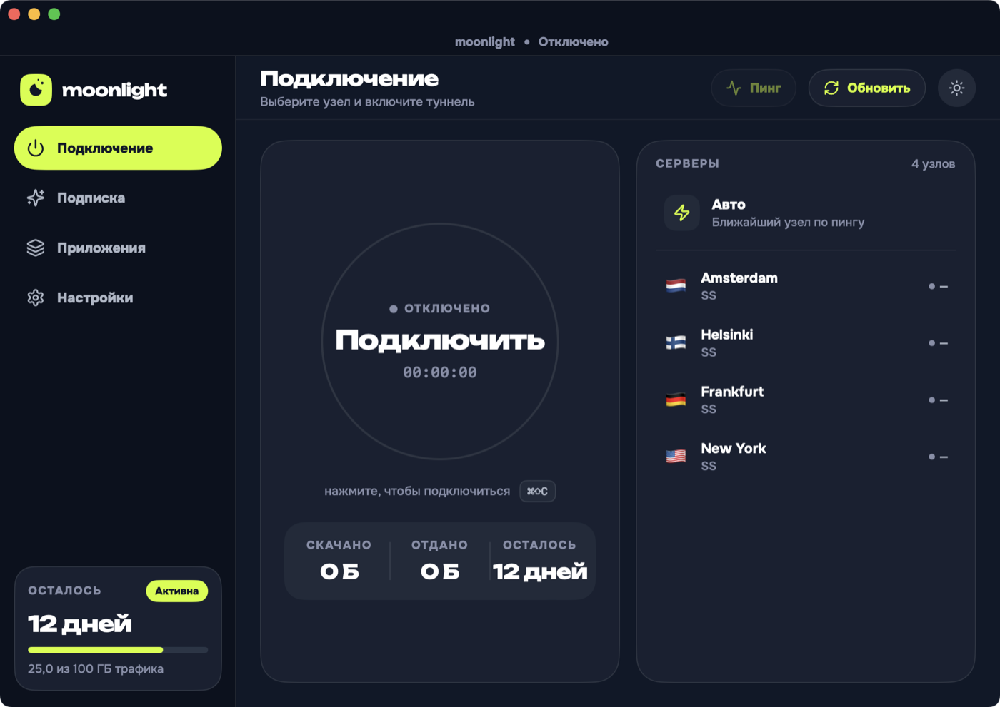
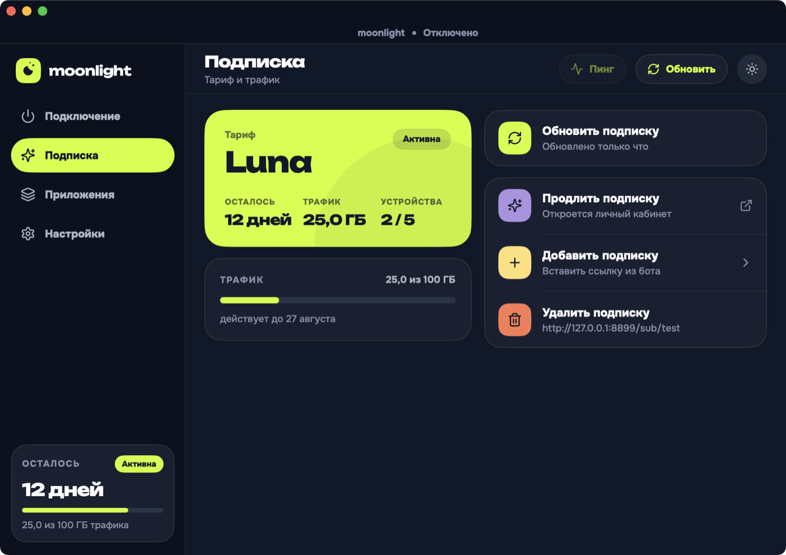
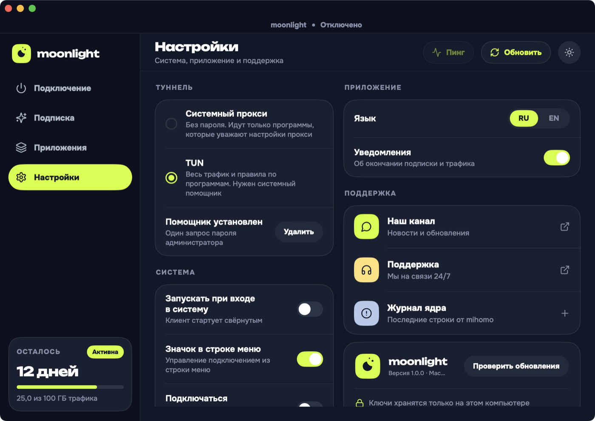
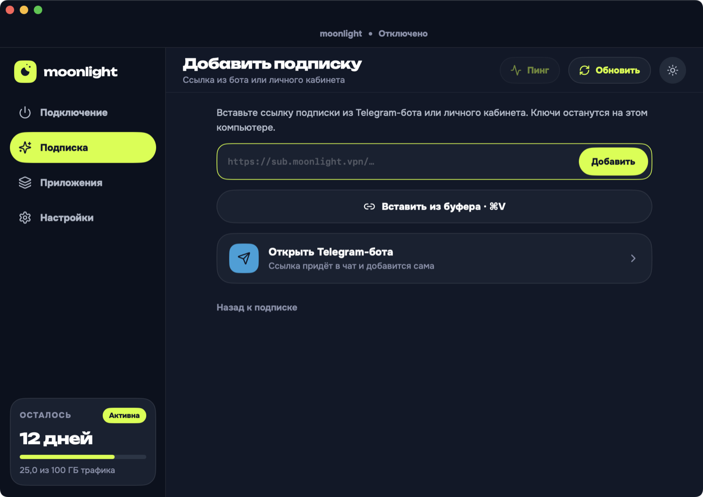

# Moonlight VPN — macOS

A SwiftUI client built on **[mihomo](https://github.com/MetaCubeX/mihomo) 1.19.29**,
implementing the `Moonlight Desktop` design. Subscriptions come from a Remnawave
panel. Companion to [moonlightvpn_android](https://github.com/kiineld/moonlightvpn_android),
which is the same product on Xray-core.



## Downloads

Latest release, always at the same URL:

```
https://github.com/kiineld/moonlightvpn_macos/releases/latest/download/Moonlight-universal.dmg
```

| Mac | File |
|---|---|
| Any — Intel and Apple silicon | `Moonlight-universal.dmg` |
| Apple silicon | `Moonlight-arm64.dmg` |
| Intel | `Moonlight-x86_64.dmg` |

The universal build runs everywhere; the per-architecture builds are about half
the size. The filenames carry no version, so those URLs keep working across
releases — the version is in the release title and in the bundle. **macOS 12
Monterey or later.**

Releases are cut by tagging: `git tag v1.2.3 && git push origin v1.2.3`.

### First launch

The app is **not notarised** — that needs a paid Apple Developer account — so
Gatekeeper refuses it the first time. Right-click the app in Applications and
choose *Open*, or:

```bash
xattr -dr com.apple.quarantine /Applications/Moonlight.app
```

## Architecture

```
MoonlightDesign   colour/type/motion tokens, lucide icons, an SVG path renderer
MoonlightCore     mihomo supervisor, RESTful API client, config builder,
                  subscription client, system proxy, helper client
Moonlight         SwiftUI screens, view models, the app itself
MoonlightHelper   the root LaunchDaemon that runs the core in TUN mode
```

`Moonlight → MoonlightCore, MoonlightDesign` · `MoonlightHelper` standalone.

There is **no Xcode project**. SwiftPM builds the executables and
`scripts/build-app.sh` assembles the bundle around them, so the whole thing —
including the test suite — builds with the Command Line Tools alone. Only a
universal (`ARCH=universal`) build needs full Xcode, because `swift build
--arch` shells out to `xcbuild`. Tools that ship the macOS 27 SDK cannot find
the SwiftUI macro plugin under it; build against the 26.5 SDK there with
`SDKROOT=/Library/Developer/CommandLineTools/SDKs/MacOSX26.5.sdk`.

### The data path

```
app traffic → system proxy or utun → mihomo → VLESS/Trojan/SS node
                                        ↑
                        app ── RESTful API on 127.0.0.1:9797
```

The core is never reconfigured by restarting it. Switching a node, applying
rules, or loading a refreshed subscription all go through the API or a
config reload, so the tunnel survives every one of them. The config is kept
inside the core's home, `…/Moonlight/core/config.yaml`: mihomo reloads only from
a path under its home directory, and a config kept beside it started fine and
then failed every refresh.

### The core runs whether or not the tunnel is on

A core being up and traffic being routed through it are separate facts, and this
client keeps them separate. As soon as there is a subscription the core starts —
with no proxy settings written and no TUN block in its config, so it routes
nothing. Connecting then only points traffic at a core that is already warm.

That is what makes a latency pass immediate: the outbounds a probe needs already
exist, so pressing ping starts measuring instead of starting a core. It is
also how FlClash and Clash Verge Rev behave, and why their ping feels instant.

TUN is the one exception. Its core has to run as root under the helper, so
connecting there stops the idle core and starts the privileged one; disconnecting
reverses it.

## Two ways traffic reaches the tunnel

These are different mechanisms, not a preference.

| | System proxy | TUN |
|---|---|---|
| Privileges | none | root, via a helper installed once |
| Captures | apps that honour the system proxy | everything |
| Per-app rules | **no** | yes |

`SystemProxy` writes the same preferences the Network pane does, through
`networksetup`. What it buys is also what it costs: an app with its own socket
stack, or anything on QUIC, goes straight out the physical interface.

TUN takes a `utun` interface and captures everything, which needs root — and no
amount of entitlement work changes that for an unsigned app. The helper is a
LaunchDaemon installed with **one** administrator prompt, because asking for a
password on every connect is how people end up leaving TUN off.

The transport is switched beside the state pill on the connect page as well as
in Settings; switching while connected reconnects. Asking for TUN there with no
helper installed goes to Settings, with the install lit, and TUN comes on once
the helper is in.

### The helper's trust boundary

A root daemon taking instructions over a socket is a privilege escalation
waiting to happen, so it is deliberately narrow:

- **It never execs a path the client supplies.** The core binary is a root-owned
  copy made at install time; that path is compiled in. There is no field for
  naming another one.
- **It never opens a config path the client supplies.** The client sends config
  *text*; the helper writes it into its own root-owned directory. Otherwise a
  symlink into that directory would let any local user have root read a file.
- **The socket is 0660 root:admin**, so callers are exactly the accounts that can
  already run `sudo`. This spares the user a password prompt per connect; it is
  not a boundary against an administrator.

The helper runs a root-owned **copy** of the core, made when it was installed,
and nothing used to update that copy — so an app update that needed a newer core
left TUN on the old one. The service's LTE servers use XHTTP's padding and
placement options, which mihomo reaches only from 1.19.30 (1.19.29 fails every
probe): after the core moved to 1.19.31 they worked everywhere but in TUN. The
app now compares the installed helper — its program and its core's version —
with its own and, when they differ, replaces it on the next TUN connect (the
same one admin prompt the install asks for); Settings says so with an update
button.

The helper stops its core and exits on SIGTERM, which is how `launchctl bootout`
and a shutdown ask it to go. Until 1.6.4 its signal handlers sat on the main
queue while the main thread never left its `accept` loop, so SIGTERM was ignored
and launchd SIGKILLed it five seconds later — orphaning a connected core with
the tunnel's interface and routes. Install and removal also wait until launchd
has really removed the old service before going on: `bootout` returns early,
and a `bootstrap` in that window fails with "Bootstrap failed: 5". Files are
replaced by rename, never by writing into a binary that may still be running.

## Logs and connections

Two screens over the core's own streams.

**Logs** merges the core's `/logs` with the app's own narration on one timeline,
and that pairing is the point: read apart, a failed connect is a core error with
no cause; together it is "the app switched to TUN, then the core could not take
the route". Filterable by source, by level (as a floor — WARN means warnings and
errors) and by text.

**Connections** polls `/connections` once a second and groups by process, which
is the question people actually bring to it: is *this program* going through the
tunnel. Expanding a row shows the hosts behind it, each with the node that
carried it and the rule that chose. Any row can be closed — one process's
connections or a single one — because the core reopens whatever the program
still wants, so closing reads as "move this app onto the node I just picked"
rather than as cutting it off. `find-process-mode` is therefore always on —
it costs a `libproc` lookup per connection, and without it every row reads "—".

### Page changes do not cross-fade

Deliberately. Every transition tried — a crossfade, or `.identity` on the
removal — keeps the outgoing screen in the hierarchy for the length of the
animation, so the previous page shows *through* the new one and reads as a
blink. The page swaps at once and plays an entrance, which starts only after
the old one is gone — one entrance for every page, header included, applied at
the root (`PageEntrance`): the page fades in as it settles the last few points
into place, on the standard curve. The screens used to carry their own, and no
two pages arrived alike. On macOS 14 and later the curve is scoped to the fade
and the offset alone, so a page that centres itself on arrival starts centred
rather than sliding there.

### One core, one controller port

A privileged core outlives the app that started it: it is a root daemon's child,
not the app's. Left running from a previous session it holds the controller
port, so the core this session starts cannot bind it and **every API call
silently addresses the old core instead** — wrong nodes, wrong connections, and
a tunnel still carrying traffic while the window says "Отключено". Launch
therefore stops any privileged core it did not ask for, alongside restoring the
proxy settings.

That clean-up is also why **only one copy runs at a time**. A second copy — say
one opened from the DMG while the installed one runs — would take the first
one's core for an orphan and stop it. It now brings the running copy forward
and exits before touching anything.

### Quitting, and starting at login

Quitting brings everything down — routing, the proxy settings, and the idle core
too, which `disconnect()` deliberately keeps warm while the app is open. The
teardown runs under `.terminateLater`; it used to be awaited on a semaphore in
`applicationWillTerminate`, which blocked the very thread the disconnect needed,
so every quit stalled eight seconds and then left the tunnel up. Quitting is
also quick now: the idle core is signalled and not waited for (it owns no system
state), and only the proxy settings this app changed are put back. Restoring
with no snapshot used to switch **every** proxy off on every network service —
TUN never sets one, so each TUN disconnect turned off any other client's proxy,
at three `networksetup` runs per service.

The app starts at login when **Запускать при входе в систему** is on, and only
then. The switch is read from the system (`SMAppService`, or the LaunchAgent on
Monterey) rather than from a stored preference, and after a change it settles on
what actually registered. The app also opts out of macOS relaunching it at
login — a menu bar app is still running at shutdown, so "reopen windows" brought
it back regardless of the switch. A login launch starts tucked away: into the
menu bar when the icon is there, otherwise minimised to the Dock.

## Updating

The app is not notarised and there is no App Store, so **Settings → Проверить
обновления** does what a user would otherwise do by hand: ask GitHub for the
latest release, download the universal DMG, and swap the bundle.

The app also asks once each time it opens, quietly: a failed check goes to the
log, not onto the Settings page. When there is a newer version a banner says so
in the corner of the window; clicking it opens Settings and starts the install,
with its progress in view, and its cross puts it away until the next launch.
The updater is one object for the whole app, so Settings shows what that check
found.

The download reports as it goes — "12,3 МБ из 36,6 МБ" beside the spinner,
with a bar, the version, and a line saying what the wait ends in — and the
image is checked against the `.sha256` the release attaches before anything is
touched. A damaged download fails there, with the working app still in place.

The swap runs in a **detached shell script**, not in-process. An app cannot
replace its own bundle while running, and a process that deletes its own
executable behaves unpredictably from that moment on. The script waits for the
app to exit, mounts the image, `ditto`s the new bundle over the old one —
restoring the old one if the copy fails, rather than leaving no app at all — and
relaunches. An app still there after 30 seconds is stopped first: swapping the
bundle under a live app left it running the old version, and the relaunch then
only brought that old window forward.

The app is asked to quit with `AppExit.quit()`, never `NSApp.terminate` from a
`Task`. It answers "terminate later" while it brings the tunnel down, and AppKit
waits for that answer in a nested run loop *inside the block that asked* — so a
main-queue block that calls `terminate` deadlocks the main queue: the teardown
never runs, nor its fallback timer, and the app sits in "quitting" until it is
force-quit. Scheduling the call on the run loop avoids it.

Versions compare numerically, so 1.0.10 beats 1.0.9; a string comparison gets
that backwards.

## Rules

The rules page works the way Flowvy's does. **My rules** are the user's own:
what to match, and where to send it — `DIRECT` (around the tunnel), `REJECT`,
or one of the subscription's groups. Each goes before the subscription's rules
(**Override**) or after them (**Extend**); mihomo takes the first rule that
matches, so that is the whole of a rule's priority. They are kept by the app,
apart from the subscription, so a refresh never touches them.

| Kind | |
|---|---|
| `DOMAIN` `DOMAIN-SUFFIX` `DOMAIN-KEYWORD` `DOMAIN-REGEX` `GEOSITE` | by host |
| `IP-CIDR` `IP-CIDR6` `IP-ASN` `GEOIP` `SRC-IP-CIDR` | by address |
| `DST-PORT` `SRC-PORT` | by port, a range, or several joined by `/` |
| `PROCESS-NAME` `PROCESS-PATH` and their `-REGEX` forms | by process — TUN only |
| `NETWORK` | tcp or udp |

A process rule's value can be picked from the running and installed apps, which
fills in the executable, its path, or a pattern for either. Rules can be
switched off, edited, deleted and dragged into order; all of it is a draft until
**Apply**, and Apply has the core check the config those rules would produce
(`mihomo -t`) before anything is kept. A value is validated as it is entered
too — regexes compile, ports and CIDRs are range-checked, commas are refused —
because a bad rule does not fail on its own: the core refuses the **whole
config**, and a connected tunnel would stop carrying anything.

Extend rules go after the subscription's rules but before its catch-all
`MATCH`; appended after it, as the grammar would literally have it, they could
never match. A rule pointing at a group the subscription has since dropped is
left out of the config, and shown in red, rather than taking the config down.
Rules apply in the "rules" routing mode, not in global or direct.

**Subscription rules** lists the subscription's own rules as it wrote them —
logical rules and `no-resolve` parsed properly, not split on commas — to read.

### Per-app routing

An app is a process rule: `PROCESS-NAME`, matched on the **executable name** —
`CFBundleExecutable`, not the bundle id, because the core sees a process — sent
wherever the rule says. Earlier versions had an apps screen for this, with
switches per app and three split modes (every connection through the tunnel,
only the selected apps, or all but them). Rules do that job and more, so the
screen and its modes are gone. The first launch without them carries over what
was set there as rules of the user's own and forgets the rest: from "all but
these" as rules to `DIRECT`, from "only these" as rules to the group the
subscription routes through — the rest of the traffic then follows the
subscription's rules, which is the one thing a rule cannot say — and from "all
traffic", where they did nothing, switched off.

## Subscriptions

Remnawave serves a subscription in six shapes, chosen by a path suffix. The
order this client tries them is load-bearing:

1. **`<url>/mihomo`** — a Clash.Meta config written by the panel operator. It can
   carry proxy groups, a `url-test` balancer across a dozen nodes, its own DNS
   and routing rules.
2. **`<url>/clash`** — the same idea for stock Clash.
3. **The bare URL** — base64 or plain share links, one URI per node. Every group,
   balancer and routing rule is flattened away by that format, so a node whose
   panel entry was a balancer arrives as a single unusable placeholder.

The panel's document is then kept **verbatim**. `MihomoConfig` overrides only
what the client must own — the API address and secret, the local port,
`allow-lan: false` and a loopback bind, the TUN block, and the user's own rules. A
panel that ships a `geosite:category-ru → DIRECT` rule means it, and its tuning
is usually better than anything generated here.

Share links are still parsed for `vless://`, `vmess://`, `trojan://` and `ss://`
so the third path produces something usable. A Reality node with no `pbk` is
dropped there rather than passed on, because mihomo refuses the whole config
rather than skipping one node.

The subscription request carries Remnawave's device headers:

```
x-hwid:         <random UUID, minted once, stored in UserDefaults>
x-device-os:    macOS
x-ver-os:       <system version>
x-device-model: <MacBook Pro, …>
```

The HWID is a **random UUID, not a hardware identifier**. It gives the panel a
stable per-install handle for its device limit and carries no hardware identity
off the machine.

### Response headers

Every header Remnawave sends (`ISubscriptionHeaders` in its backend) is read,
and each takes precedence over `<url>/info`, field by field. A missing field
reads as *unknown* rather than zero — a plan whose response omits `total` is
unlimited, and showing "0 GB" for it would be a lie the user acts on.

| Header | Used for |
|---|---|
| `subscription-userinfo` | traffic used and allowed, expiry; `0` means unlimited |
| `profile-title` | the plan name |
| `announce` | a banner on the connect and subscription screens, hidden per message |
| `profile-web-page-url` | where **Продлить подписку** goes, before the bot |
| `support-url` | where **Поддержка** goes, before the built-in link |
| `profile-update-interval` | the default auto-update interval, in hours |
| `subscription-refill-date` | "Трафик обновится …" under the traffic bar |
| `x-hwid-max-devices-reached`, `x-hwid-not-supported` | the device-limit answer |
| `content-disposition`, `routing` | not read — an account name, and another client's routing profile |

Text values may come as `base64:<payload>` — how Remnawave renders anything its
operator wrapped in `rwEncodeBase64:` — and are decoded, URL-safe alphabet and
missing padding included. Links are accepted only as `https`/`http` (and `tg`,
`mailto` for support), since the app opens them on a click.

At its device limit Remnawave answers **HTTP 200 with an empty body** and says
so only in a header. Read without it, that was "the subscription is empty"; it
is now the device limit, with the service's own `announce` text when it sent
one, and the other endpoints are not tried after it. Remnawave also spells
"never expires" as a date in 2099 in `/info` (its headers send `0`); that is
read as no expiry, not as 26 892 days.

### Auto-update

**Настройки → Автообновление подписки**: off, or every 1, 6, 12 or 24 hours.
Until one is picked the service's `profile-update-interval` applies, snapped to
the nearest of those, and a day when it sends none. The schedule survives
relaunches — the time of the last successful refresh is stored — and is checked
every five minutes and on wake, so a Mac asleep through the due time refreshes
when it opens. Launch refreshes only when due; "off" means only the refresh
button and ⌘R.

A new link replaces the current one **only once it has loaded**. It used to be
stored first, so a mistyped link — or the server having a bad minute — left a
working subscription replaced by one that loaded nothing.

### Nothing about the service reaches the screen

No screen names the service behind the subscription, or shows the link, a
server's address or a credential:

- Errors are a `TunnelIssue` the app words itself, in Russian or English —
  "Сервер подписки временно недоступен (ошибка 502)", not "Panel returned HTTP
  502". The technical description goes to the log.
- The log masks, in every line and in lines already kept, the subscription link,
  its host and token, and every server the subscription names — core errors
  quote server addresses (`dial tcp …`).
- The subscription screen no longer prints the link under "Удалить подписку";
  the link is a credential.
- The account username from `/info` is not used as the plan name.

### The subscription client ignores the system proxy

This is the macOS counterpart of the Android client excluding itself from its
own tunnel. While connected in system-proxy mode the app has pointed the whole
machine at its own core, and a shared `URLSession` would send the subscription request
back through the tunnel it is managing. It also means a stale proxy left behind
by any other client cannot swallow this app's requests — which is a silent hang
with no timeout, because the connection is established and simply never
answered.

## Latency probing

Measured through the running core's `/proxies/{name}/delay` against
`http://cp.cloudflare.com/generate_204`, so each probe uses that node's own
outbound. The same target drives the `url-test` group this client injects.

**http, not https**, and Cloudflare rather than Google: the probe is timing the
path to the node, and a TLS handshake to the *target* adds a round trip that
says nothing about it. Cloudflare answers `204` with an empty body from a global
anycast address, so the number is about the node rather than about which
continent the target sits on. Switching to it on a live 20-node subscription
took the fastest node from 162 ms to 37 ms and raised the nodes that answered at
all from 10 to 18 — `gstatic.com` is itself blocked or slow from several of
them, which made the probe measure the target's reachability instead of the
node's. The core multiplexes them, so a full pass costs about
as long as its slowest node rather than the sum; concurrency is still capped at
8, because a subscription with sixty nodes would otherwise open sixty TLS
handshakes at once and measure congestion instead of latency.

Available whether or not the tunnel is up, because a core is always running.

Results are applied **as each node answers** rather than at the end of the pass.
A pass over twenty nodes takes several seconds no matter how it is written — the
dead ones have to time out — so reporting each result as it lands is what makes
it feel immediate: the fast nodes, which are the ones being chosen between,
appear straight away instead of behind the slowest entry in the list.

Numbers are kept in preferences, so they survive a screen change, a reconnect
and a relaunch. A measurement opens a connection through every node, and
throwing it away because the user looked at Settings makes the server list
useless exactly when they are choosing from it.

An unreachable node reads **n/a**, not an error and not a dash: a timeout is the
expected answer for a node that is down, and "not measured yet" is a different
thing worth telling apart from it.

## Geodata

Not shipped. mihomo downloads `GeoSite.dat`/`GeoIP.dat` on demand into
`~/Library/Application Support/Moonlight/core/` the first time a config
references a `geosite:`/`geoip:` rule, which every panel config does. That costs
one download on first connect and saves ~24 MB in the bundle.

## Design system

**Black and white.** The interface is monochrome: a black canvas, surfaces of
Liquid Glass, white type, and white as the one interactive colour — black in
the light theme, which mirrors it. Colour is spent in exactly two places: the
brand — the logo's lime tile, and the moon on the connect button once it is
full — and the small signals that carry meaning — latency (green under 150 ms, yellow under 300,
orange past it), errors, log levels. The token names are the ones every screen
was written against; what they resolve to is what changed:

- `accent` — fills (the primary button, active pills, a switch that is on)
- `accentInk` — accent as type or a glyph
- `textOnAccent` — type sitting on an accent fill
- `brand` / `brandInk` — the logo tile, and the full moon of a connected tunnel

Icons are **lucide 0.468.0**, the set the design is drawn with, carried across as
raw SVG path data rather than redrawn or swapped for SF Symbols, so stroke
geometry is identical. `scripts/gen-icons.py` converts every `<circle>`,
`<rect>`, `<line>` and `<polyline>` to path commands at generation time, so the
renderer only parses `d` strings.

Fonts are Onest (UI/body) and Unbounded (display — titles, hero numbers, the
plan, stat values, the wordmark) as variable TTFs from Google Fonts; the design
ships `woff2`, which Core Text cannot register.

**The connect control is the moon from the logo.** Disconnected it is the
logo's crescent, dim, with its two stars; connected the cut slides off and it is
a full moon, lit in the logo's own colour in both themes, and the stars fade.
Changing state is the moon changing phase. The crescent is a disc with a second
disc cut out of it (`.destinationOut`), not painted over, so the glass beneath
shows through its dark side. While the tunnel connects or disconnects a thin
orbit turns round it. The state pill under it leads to the connections screen,
and beside it is the transport, proxy or TUN; ping and refresh are icon buttons
over the server list, the list they act on. A refresh from there says how it
went at the foot of the page — updated, or not and why, in the same neutral
words as any other issue.

The routing mode is mihomo's own `mode`, patched into the running core and
written into every config it is built with; existing connections are closed
so they reopen under it. Global points mihomo's `GLOBAL` group at the app's
selector, so the chosen server is still the one used. Descriptions come from
the subscription — a server's `serverDescription`, a group's `description` (a
balancer such as "🇵🇱 Poland LTE 1" is a row like any server) — which the
service includes in some responses and not others; the last ones seen are kept.

The server list works as on the phone: a pill naming the server in use, which
opens into the full list beneath it. Closed, the power button is drawn at twice
its size, and the column it heads — time, button, state, servers — is centred
on the *window*, as much space above as below. Opening the list shrinks the
button and lifts the column to the top, and the list takes the room that frees.
The offset is worked out from the parts above and below the button, which the
drawer does not change, so the move is one animation; and a line appearing
under the button — an error, the service's message — re-centres the page on the
same curve rather than in one frame, which is what made a connect or a refresh
look like the page jumped.

### Motion

One curve: everything that moves — a page arriving, the drawer, the power
button, a selection pill, the sidebar folding — moves on `Motion.standard`, a
spring damped just short of settling on its own, so it eases in and lands
without an overshoot. Only changes with nothing moving in them (a colour, a
hover wash) use `Motion.paint`, a short fade. The app used to carry six curves,
two of them overshooting, and screens felt like different apps.

The sidebar's selection is the one thing that moves as a liquid rather than a
solid: a single piece of glass behind the rows, whose leading edge travels on a
quick spring and trailing edge on the standard one, so it stretches towards the
new row and gathers itself up there. It is driven by a timeline that ticks only
while it moves — two edges animated with two `withAnimation` curves came out on
one, and slid as a rigid tile.

Connecting, disconnecting and refreshing block nothing on the main thread,
which is the one that draws. `networksetup` (three reads and four writes per network service — a Mac with
ten services ran some seventy of them on a connect), the helper's stop, which
waits for its core, `mihomo -t`, and every parse of the subscription all run
off it; they used to freeze the window at exactly the moment the moon was
animating. The uptime and speeds, which tick every second, live on their own
`TrafficMeter`, so a tick redraws the two labels that show them rather than
every view watching the tunnel; and the app's scene observes neither the tunnel
nor the log, which had it rebuilding its window and menus on every line the
core logged.

Spinners are driven by the clock (`TimelineView`), never by
`repeatForever`. A repeating animation claims every other change in its
transaction and every layout change while it runs, so a spinning refresh icon
dragged its button round in a loop whenever the page moved, and the connect
spinner wobbled as the page re-centred under it.

The connections page draws nothing until its first answer arrives — the empty
state used to flash on every visit — and keeps rows in the order processes
appeared, where sorting by live traffic reshuffled them every second.

### Liquid Glass

Every surface is Apple's Liquid Glass, through SwiftUI's own `glassEffect`
(`Sources/Moonlight/Glass.swift`): cards, rows, pills, buttons, fields, icon
tiles, the sidebar and its tab, the tray. A state is a tint on the glass —
white for the primary button, a wash for a selection — never a colour painted
over it. Before macOS 26 the same shapes are flat surfaces with a hairline, at
the same sizes, so nothing moves between systems.

Glass casts a soft shadow past its edge, and a scroll view clips what it holds.
Pages that scroll (`PageScroll`) reach out to the window's edges and take their
margins back inside, so the cards sit where they did and their shadows fade out
before anything clips them — inset by the margins, the clip cut them off in
straight grey lines, which the light theme's white canvas showed plainly.

Glass needs something behind it to refract. Over a flat black canvas it drew as
a grey slab with no edge, so the window is see-through: the canvas is the
desktop, blurred by the system (`NSVisualEffectView`, behind-window), under
black at three quarters, with a faint light falling in from two corners. The
window still reads as black, and the glass on it has real light to bend.

The app used to reach for `NSGlassEffectView` by name at runtime, because it
built against the macOS 15 SDK; hosted in SwiftUI that view drew flat and could
not follow an animating frame. It now builds against the macOS 26 SDK, and the
release workflow checks the binary references `glassEffect` — an older SDK
compiles the flat fallback without complaint, which would ship an app with no
glass.

| | |
|---|---|
|  |  |
|  |  |

## Building

```bash
scripts/fetch-mihomo.sh   # ~90 MB, lipo'd from the two darwin releases
scripts/fetch-fonts.sh
scripts/build-app.sh      # build/Moonlight.app
```

`ARCH=universal scripts/build-app.sh` for both slices, which needs full Xcode.
`scripts/make-dmg.sh` packages it, styling the installer window — background,
icon positions, no toolbar — through Finder, because that styling lives in the
volume's `.DS_Store` and Finder is what writes it. Without a GUI session the
image is still produced, plain but with the Applications symlink, so it installs
by dragging either way. The backdrop is drawn by
`scripts/make-dmg-background.swift` rather than shipped as an asset, so it stays
in step with the palette. `scripts/screenshots.sh` regenerates the
images above.

Requires the macOS 26 SDK (Xcode 26, or Command Line Tools that ship it) for
Liquid Glass; an older SDK builds, with flat surfaces. The app runs on macOS 12+.

### Staying on Monterey

The deployment target is 12.0, which rules out three APIs the app would
otherwise use:

| macOS 13 API | What is used instead |
|---|---|
| `MenuBarExtra` | an AppKit `NSStatusItem`, one path for every version |
| `SMAppService` | a LaunchAgent the app writes into `~/Library/LaunchAgents` |
| `scrollIndicators` | nothing — the scroller keeps its default behaviour |
| `onContinuousHover` | the pointer is pushed on hover and popped on exit |
| `ViewThatFits` | a scroll view always — the server list fills its card |

The status item opens a tray — an `NSPopover` hosting SwiftUI — with the
service's message, the state and live speeds, the routing mode (rules, global,
direct), a searchable server list with each server's transport, the service's
description of it and a ping button, a floating connect button, and a way into
the window. Pinned, it stays open when the user clicks elsewhere. The popover's
window is made key without activating the app, so the search field takes typing
without the main window coming up behind it.

`otool -l` on a release binary reports `minos 12.0`, not just the plist.

## Tests

```bash
swift run moonlight-tests
```

227 checks. A plain executable rather than XCTest, because XCTest ships with
Xcode and this package builds with the Command Line Tools alone.

They cover the parts where correctness is not visual: `subscription-userinfo`
parsing (partial, malformed, absent, zero-means-unlimited), share-link metadata
across four schemes, URL normalisation (a `file://` or `vless://` link must not
be rewritten into a plausible `https://` one), config assembly, and the user's
own rules — what each kind accepts, where Override and Extend land, the skipping
of a rule whose group is gone, and the carry-over from the apps screen — with
every kind, both ways round, loaded by the core itself, since a rule it refuses
takes the whole config with it.

The last suite runs the **real mihomo binary**: every config shape the app can
produce goes through `mihomo -t`, and one is started for real so the RESTful API
— the app's entire control channel — is exercised rather than assumed. TUN
configs are validated but never started, because a test suite must not ask for
root.

## Configuration

`Info.plist` keys, written by `scripts/build-app.sh` from the environment, so a
fork points these at its own endpoints without touching source:

| Key | Environment variable | Purpose |
|---|---|---|
| `MLTelegramBotURL` | `TELEGRAM_BOT_URL` | "Open the Telegram bot", "Extend subscription" |
| `MLTelegramChannelURL` | `TELEGRAM_CHANNEL_URL` | Settings → Our channel |
| `MLSupportURL` | `SUPPORT_URL` | Settings → Support |
| `MLCabinetURL` | `CABINET_URL` | Subscription → Personal account |
| `MLReleasesURL` | `RELEASES_URL` | "Check for updates" |

In CI these come from repository **variables** of the same name, which are set on
this repository. The source defaults match them, so a local build reaches the
same places.

`NSAllowsArbitraryLoads` is set. A subscription URL points at whatever host the
panel operator runs, and self-hosted panels are routinely reached by bare IP with
a self-signed certificate. The client upgrades a bare host to `https://`, so
cleartext only happens when the user types `http://` themselves.

### When TUN cannot start

`auto-route` installs routes covering the internet, and another VPN client
holding them makes the core log

```
Start TUN listening error: configure tun interface: add route: 1.0.0.0/8: file exists
```

and then **keep running**. It answers its API normally with no interface
established, so every other signal says "connected" while nothing is routed.
`connect()` therefore checks the log for that line before reporting success, and
names the cause rather than quoting the core at the user. The log checked is the
helper's: the tunnel counts as TUN from the moment the helper takes the config,
so the check reads the core that was just started, and a failure stops it. The TUN block also
leaves the device name to the core, because a hardcoded `utun7` collides with
whichever client already holds it.

## Known limitations

- **The tunnel has not been left up carrying ordinary traffic.** Against a live
  Remnawave panel the subscription is fetched, the config is built, the core
  loads it with the panel's own geosite rules intact, and nodes answer a
  `generate_204` through a full VLESS handshake — 10 of 20 on the pass observed,
  the rest timing out as down. So traffic does reach the nodes. What has not
  been exercised is a session left connected with the machine's own traffic
  going through it.
- **Not notarised.** See *First launch*.
- The page entrance is attached to the view rather than fired with
  `withAnimation` from `onAppear`, so if the animation is dropped the page
  appears without moving. The alternative left pages stuck at zero opacity.
- Pasting a bare `vless://` link imports nothing; the import path expects a
  subscription URL. Single-node import is not implemented.
- Reconnect-on-network-change is not implemented.
- `moonlight://` is registered as a URL scheme in `Info.plist`, but the handler
  is not wired up yet.

## Licence

MIT — see [LICENSE.md](LICENSE.md), which also lists the third-party components.
